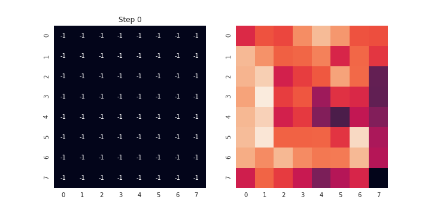
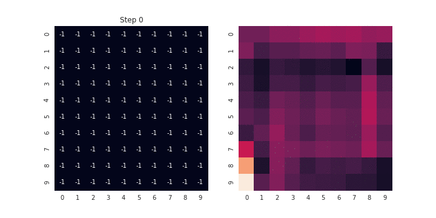

# Fully Convolutional Reinforcement Learning for Minesweeper

Contrary to popular belief, Minesweeper is not a game that involves randomly clicking on squares and hoping for the best. Instead, it a game of logic that involves figuring out how information in adjacent/nearby cells can be combined to reveal where mines are. Certain patterns are guaranteed to indicate a mine, regardless of board size or number of mines. These features can be extracted using convolution layers in a neural network, which directly take advantage of spatial relationships. 

Oftentimes in building a reinforcement learner for Minesweeper the board (in some form) will be presented to a series of convolutional layers before fully connected layers are used to approximate the Q-values of each action. However, since the action space maps perfectly to the input space, we can instead use a fully convolutional neural network to approximate Q-values. This has significant advantages in transfer learning, since we wouldn't need to retrain any layers when switching board size. This approach, however, is not entirely superior to the standard approach. 

Removing the fully connected layers also means that we have fewer parameters to train overall, which should give faster returns on training. Furhtermore, as previously mentioned a single set of trained weights can be applied to all boards. These advantage are quite significant compared to a standard convolutional neural network used in these tasks. 

On the other hand, the network would not be able to consider global features (such as number of mines overall) and would be limited to learning patterns with widths less than those of the convolutional filters being used. We can also reasonably expect a slightly lower ceiling on any given board size than a specifically trained network dealing with those boards, giving this network more of "jack of all trades" behavior. 

## The network

We use a network with 6 layers, some of which are customizable. For original testing of the model, we use a model with the following parameters:  
   
|Layer|Filters|Filter Height/Width|Customizable|Training Noise|
|:----|-------|-------------------|------------|-------------:|
|1    | 10|5|YES| NO|
|2    | 10|5|Same as Layer 1| YES|
|3    | 8|5|YES|YES|
|4    | 5|5|YES|YES|
|5    | 3|1|NO|NO|
|6    | 1|3|NO|NO|

The first layers perform feature extraction; the last 2 layers are functionally the inference layers. Layer 5 summarizes the features about each cell picked up previous convolutional layers, while layer 6 combines the summarized data to estimate the value of clicking on a given square. All activations are ReLU except for the last layer, which uses a Leaky ReLU to allow negative values (though perhaps less negative than they should be). 

## Training

Reinforcement learning training is based on a model learning "how good" it would be to take a given action. Models are presented with a set of information about their environment, known as the state, and approximate the value of each action. Models learn these values based on rewards given to them by the environment. In certain cases this can be easily represented using a table, with each row representing a given state and each column representing a potential action. Each cell would then represent the expected value of taking a given action from a given state. However, these Q-tables can be huge and the likelihood of seeing a given state more than once is low, so estimating its value is difficult. Instead, we use neural networks to approximate Q-tables, serving as a Q-function (input is the state, output is the expected value of each action). 

The network learns by playing Minesweeper repeatedly. After each game the learner takes a random sample from its last 500 (customizable) turns played and compares its evaluation of each state with their outcomes, trying to become a little less wrong each time (technically a little more complicated, see [SARSA](https://en.wikipedia.org/wiki/State%E2%80%93action%E2%80%93reward%E2%80%93state%E2%80%93action)). At the beginning of training the moves it takes are largely random (parameter epsilon), giving it a wide sample of outcomes to learn from. As it improves we start selecting its favored action more often (based on the epsilon decay rate and frequency), allowing it to refine its best guesses. To assess its improvement, we have it play 10 games with no random moves periodically, logging its win rate. 

## Results

While the graph for this was lost, we saw the model take a while to pick up how to not lose a game before steadily improving. Once this improvement began it was quite consistent, with a 10% improvement every 10,000 iterations played. We would expect this to slow and eventually plateau, and will continue to train models to confirm this. 

While the learner is still being tweaked, initial results are quite good. After approximately 100,000 games, the model was logging a 65% success rate on 8x8 boards containing 10 mines. Below is a game it played, with the heatmap on the right showing its approximated values (without scale, since we only really care about its favored action). 

Taking the same weights and applying them to a larger, much mine-y board we see degraded performance, though not terrible. 

## TODO
- Build a Double Deep-Q Learner
- Trying U-Net style architecture
- Add training graphs